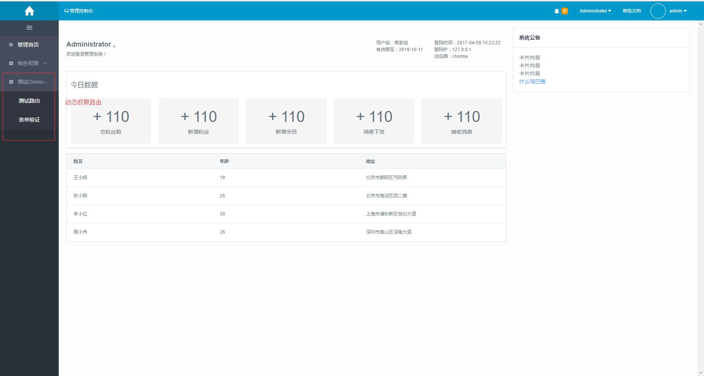

# platform

> A Vue.js project

## Build Setup

``` bash
# install dependencies
npm install

# serve with hot reload at localhost:8080
npm run dev

# build for production with minification
npm run build

# build for production and view the bundle analyzer report
npm run build --report
```

### 说明
我也是一枚菜鸟，JS 前端写的渣逼。知道 vue 也有一年多时间了。最近才下定决心用它来写个自己的项目。后端我是用PHP 开发的
因为PHP框架是自己写的 还在完善中无法提供源码。但面我提供API了，后面所有功能出来都将会一一的更新线上API。我自己写得烂得渣一逼欢迎大家提意见！！

### 前台:
   > vue-cli \
   > vue \
   > vue-router \
   > vuex \
   > iview \
   > axios

### 后台:
   > apache \
   > PHP \
   > mysql redis
   
### API
   > 之前没有提供API 现在我补上了 \
   > 把项目里的 http://www.hphp.cn 替换成 http://api.yongchuan.cc 
   > 我后端是没有开启跨域的，只有你们自己 把 config 里的 proxyTable 配置好即可
   

### 实现功能
* 登录
    * 用户登录
    * 用户退出
    
* 菜单列表
    * 左侧菜单 全根据后台取出来(2.4 路由有坑)

### 2.4 路由的坑:
   > 2.4 动态路由无论怎么追加都在通配路由后面导致登陆后取到的路由点击404页面。\
   > 我提的问题 https://github.com/vuejs/vue-router/issues/1341\
   > 解决方法 先不要安装路由 进入node_modules 单独安装
 ```
 cd node_modules
 git clone https://github.com/vuejs/vue-router.git
 npm install
 npm run build
 ```
 > 这样就可以完全解决以上问题. \
 > 目前官方没有路由删除掉。等官方下一个版本看是否有删除路由功能。暂时退出我自己把登陆追加进去的路由给删除了。

### 截图

##### 登陆页


##### 登陆后



For detailed explanation on how things work, checkout the [guide](http://vuejs-templates.github.io/webpack/) and [docs for vue-loader](http://vuejs.github.io/vue-loader).
